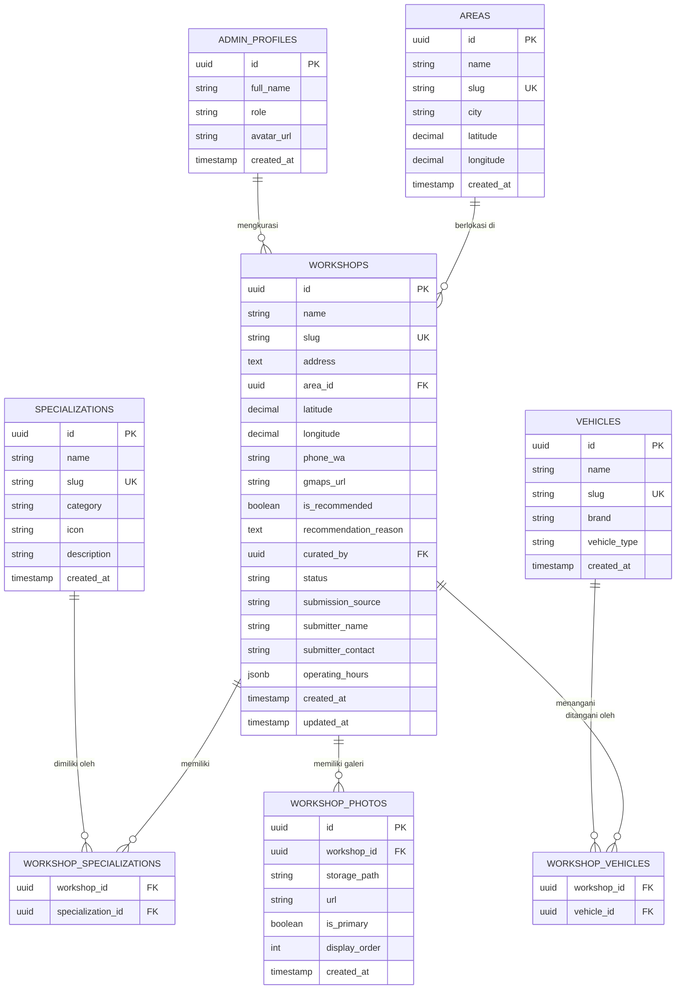

# PRD — Mangajiee Workshop Map

| Field | Detail |
|---|---|
| **Produk** | Mangajiee Workshop Map |
| **Versi** | 0.5 — Stack, Schema & CI/CD Final |
| **Status** | 🟢 Review Ready |
| **Tanggal** | 2026-10-07 |
| **Author** | Mangajiee Team |
| **Scope** | MVP · Bandung · Web |

---

## 1. Overview

### Tagline
> *"Find the right workshop, not just the nearest one."*

### Deskripsi Singkat

**Mangajiee Workshop Map** adalah platform berbasis web yang membantu pemilik kendaraan menemukan bengkel yang **tepat** — bukan sekadar yang terdekat. Mangajiee mengkurasi bengkel secara manual dan menyajikannya dalam bentuk interactive map yang bisa difilter berdasarkan jenis kendaraan, spesialisasi, dan lokasi.

### Core Idea

> *"Mangajiee bukan sekadar menunjukkan bengkel mana yang dekat. Mangajiee membantu menentukan bengkel mana yang layak dipercaya."*

---

## 2. Problem Statement

### Masalah Utama

Pemilik kendaraan yang mencari bengkel saat ini mengandalkan:
- ⚠️ **Google Maps** → banyak pilihan, tapi tidak kontekstual
- ⚠️ **Rating bintang** → mudah dimanipulasi, tidak spesifik soal keahlian
- ⚠️ **Rekomendasi teman** → terbatas, tidak selalu relevan dengan kebutuhan spesifik
- ⚠️ **Konten media sosial** → informatif, tapi tidak terstruktur untuk pengambilan keputusan

**Root problem:**
Bukan kurangnya **daftar** bengkel — melainkan kurangnya **kepercayaan** untuk menentukan bengkel mana yang benar-benar cocok untuk kebutuhan spesifik mereka.

### Contoh Skenario

> User mencari *"bengkel BMW yang jago kaki-kaki di Bandung."*
>
> Saat ini: dia scroll Google Maps, buka 5–10 listing, baca review acak, dan tetap tidak yakin.
>
> Dengan Mangajiee: dia mendapat daftar workshop yang sudah dikurasi, lengkap dengan spesialisasi dan alasan kenapa Mangajiee merekomendasikannya.

---

## 3. Solusi

Mangajiee mengkurasi bengkel secara manual dan menyajikannya melalui **interactive workshop map** dengan lapisan kurasi, filter kontekstual, dan rekomendasi berdasarkan pengalaman langsung.

### User Journey

```
Cari
  ↓
Filter (lokasi · spesialisasi · jenis kendaraan)
  ↓
Lihat Workshop Card
  ↓
Baca "Why Mangajiee Recommends It"
  ↓
Hubungi (WhatsApp) / Navigasi (Google Maps)
```

---

## 4. Target User

### Primary User: Pemilik Kendaraan

| Atribut | Profil |
|---|---|
| **Geografi** | Bandung (MVP) |
| **Kendaraan** | Mobil (prioritas), motor (fase 2) |
| **Pain point** | Tidak tahu bengkel mana yang bisa dipercaya untuk masalah spesifik |
| **Trigger** | Ada masalah kendaraan / butuh servis rutin / pindah kota baru |
| **Behavior** | Sudah terbiasa pakai Google Maps, aktif di medsos, trust konten kreator |

### Secondary User: Workshop Owner

| Atribut | Profil |
|---|---|
| **Kebutuhan** | Visibilitas dan reputasi yang terverifikasi |
| **Pain point** | Susah membedakan diri dari bengkel "random" di Google Maps |
| **Benefit** | Listing kualitatif yang mencerminkan keahlian nyata |

---

## 5. Pembeda Utama (Differentiators)

### 5.1 🏅 Mangajiee Recommended

Workshop yang **benar-benar direkomendasikan** oleh Mangajiee berdasarkan kurasi dan pengalaman langsung.

> **Badge ini tidak bisa dibeli. Tidak bisa dibayar. Tidak bisa dinegosiasi.**

Ini adalah aset kepercayaan terbesar Mangajiee. Jika badge ini bisa dibeli, seluruh nilai platform runtuh.

---

### 5.2 🔧 Workshop Specialization

Workshop tidak hanya dikategorikan sebagai *"bengkel mobil"*, tetapi berdasarkan keahlian spesifik:

| Kategori Spesialisasi | Contoh |
|---|---|
| **Brand Specialist** | BMW, Mercedes, Toyota, Honda, Mitsubishi |
| **Mechanical** | Kaki-kaki, Mesin, Transmisi |
| **Electrical** | Electrical diagnosis, ECU, Audio |
| **Body & Paint** | Body repair, cat, dent removal |
| **AC** | AC specialist |
| **Performance** | Tuning, modifikasi performa |
| **EV** | Electric vehicle specialist |
| **Umum** | Service rutin, tune-up |

Setiap workshop bisa memiliki **lebih dari satu** spesialisasi.

---

### 5.3 💬 Why Mangajiee Recommends It

Setiap workshop yang mendapat badge *Mangajiee Recommended* wajib memiliki narasi alasan yang jelas, ditulis oleh Mangajiee:

> *"Spesialis BMW dan Mercedes, dikenal kuat di pengerjaan kaki-kaki dan diagnosis electrical. Mekanik senior berpengalaman >15 tahun. Harga transparan, tidak ada biaya tersembunyi."*

Format narasi ini bukan iklan — ini adalah **opini editorial** Mangajiee yang jujur.

---

## 6. Fitur MVP

### Scope MVP: Bandung · 50–100 Workshop · Web

#### 6.1 Interactive Map

| Fitur | Detail |
|---|---|
| Map provider | Google Maps / Mapbox (TBD) |
| Workshop pin | Muncul di map berdasarkan koordinat |
| Cluster | Pin dikelompokkan saat zoom out |
| Click pin | Buka workshop card / sidebar |
| Mangajiee Recommended | Pin dengan badge khusus (warna / ikon berbeda) |

---

#### 6.2 Search

| Fitur | Detail |
|---|---|
| Search by query | Cari nama bengkel, spesialisasi, atau area |
| Autocomplete | Saran saat mengetik |
| Search by area | "Bengkel di Dago", "bengkel di Buah Batu" |

---

#### 6.3 Filter

| Filter | Opsi |
|---|---|
| **Spesialisasi** | Kaki-kaki, AC, Body, Electrical, Performance, EV, dll |
| **Brand kendaraan** | BMW, Toyota, Honda, Mercedes, Mitsubishi, Umum, dll |
| **Mangajiee Recommended** | Toggle: tampilkan hanya yang direkomendasikan |
| **Status** | Buka sekarang |

---

#### 6.4 Workshop Card / Detail Page

| Elemen | Detail |
|---|---|
| Nama workshop | — |
| Foto workshop | Min. 3 foto |
| Alamat lengkap | — |
| Spesialisasi | Tag/badge spesialisasi |
| Jam operasional | Per hari, buka/tutup real-time indicator |
| Nomor telepon | — |
| WhatsApp CTA | Tombol langsung buka WhatsApp |
| Google Maps Direction | Tombol navigasi ke workshop |
| Mangajiee Recommended badge | Jika berlaku |
| "Why Mangajiee Recommends It" | Narasi editorial (hanya jika Recommended) |

---

#### 6.5 Admin Panel

| Fitur | Detail |
|---|---|
| Tambah / edit / hapus workshop | CRUD lengkap |
| Upload foto | — |
| Set spesialisasi & brand | Multi-select |
| Set jam operasional | Per hari |
| Toggle Mangajiee Recommended | Dengan input narasi wajib |
| Set koordinat map | Manual input atau pin di map |

---

## 7. Yang TIDAK Dibangun di MVP

Daftar berikut **sengaja ditunda** agar tim fokus pada nilai inti:

| Fitur | Alasan Ditunda |
|---|---|
| ❌ Booking / Reservasi | Kompleksitas tinggi, bukan kebutuhan inti MVP |
| ❌ Payment / Transaksi | Butuh regulasi & trust yang belum terbangun |
| ❌ AI / Chatbot | Premature, bisa distorsi kurasi manual |
| ❌ Membership / Login User | Friction tambahan di MVP |
| ❌ Aplikasi mobile native | Web-first dulu, validasi pasar |
| ❌ Marketplace / Harga | Terlalu kompleks untuk tahap awal |
| ❌ Review / Rating sistem | Mudah dimanipulasi, perlu moderasi |

---

## 8. Monetisasi

### Prinsip Utama

> **Uang tidak boleh memengaruhi kurasi.** Paid placement tidak pernah = Mangajiee Recommended.

### Struktur Monetisasi

#### Untuk User
| Tier | Harga | Akses |
|---|---|---|
| Free | Rp 0 | Semua fitur platform |

#### Untuk Workshop
| Tier | Deskripsi |
|---|---|
| **Free Listing** | Terdaftar di map, fitur dasar |
| **Featured Listing** | Muncul lebih menonjol di hasil pencarian & map (paid) |
| **Premium Profile** | Foto lebih banyak, info lebih lengkap, highlight branding (paid) |
| **Promotional Campaign** | Kampanye promosi di platform (paid) |

#### Bundle Mangajiee Media + Map

Mangajiee bisa menawarkan paket yang menggabungkan:
- Konten TikTok / Instagram tentang workshop tersebut
- Featured listing di Workshop Map

> Ini adalah leverage unik Mangajiee sebagai content creator yang juga memiliki platform.

---

## 9. Metrik Keberhasilan MVP

| Metrik | Target 3 Bulan Pertama |
|---|---|
| Jumlah workshop terdaftar | 50–100 |
| Workshop dengan Mangajiee Recommended badge | Min. 20 |
| Monthly active visitors | 1.000+ |
| WhatsApp click-through (dari platform ke WA workshop) | 200+/bulan |
| Bounce rate | < 60% |
| Feedback positif dari workshop owner | 80%+ |

---

## 10. Visi Jangka Panjang (Roadmap)

```
Phase 1: Workshop Discovery (MVP)
  ↓ Interactive Map · Search · Filter · Workshop Detail · Admin

Phase 2: Platform Expansion
  ↓ Kota lain · Motor · My Garage · Service History · Maintenance Reminder

Phase 3: Monetisasi Lebih Dalam
  ↓ Mangajiee Plus · Booking · Workshop CRM

Phase 4: AI & Intelligence
  ↓ AI Vehicle Assistant · Second Opinion · Predictive Maintenance

Phase 5: Ekosistem Penuh
  ↓ Affiliate · Marketplace Part · B2B Workshop Tools
```

### Tujuan Akhir

Mangajiee bukan sekadar direktori bengkel.

**Mangajiee adalah platform yang membantu pemilik kendaraan mengelola kendaraan mereka** — mulai dari menemukan bengkel yang tepat, mencatat histori servis, sampai mendapat pengingat maintenance.

Mangajiee Social Media adalah funnel kepercayaan.
Mangajiee Workshop Map adalah produk pertama yang mengkonversi kepercayaan itu menjadi utilitas nyata.

---

## 11. Asumsi & Risiko

| Asumsi | Risiko Jika Salah |
|---|---|
| User mau beralih dari Google Maps ke platform khusus | Adoption rendah → butuh strong differentiation & push dari konten |
| Mangajiee bisa mendapat 50–100 bengkel berkualitas di Bandung | Kualitas kurasi tidak terjaga → reputasi rusak |
| Workshop owner mau listing gratis tanpa resistansi | Proses onboarding lambat → supply terbatas |
| Badge Recommended dianggap berharga oleh user | Diferensiasi tidak terasa → platform jadi direktori biasa |

---

## 12. Open Questions

> ✅ = Sudah diputuskan · 🔲 = Belum diputuskan

| # | Pertanyaan | Status | Keputusan |
|---|---|---|---|
| 1 | Map provider mana yang dipakai? | ✅ | OpenStreetMap + Leaflet.js (free, no API cost) |
| 2 | Siapa yang bisa input data workshop? | ✅ | Admin Mangajiee |
| 3 | Foto workshop dari mana? | ✅ | Bisa dari admin atau submit oleh pemilik bengkel |
| 4 | Tech stack frontend? | ✅ | Next.js + Tailwind CSS |
| 5 | Tech stack backend? | ✅ | Next.js API Routes + Supabase (DB + Auth + Storage) |
| 6 | Siapa yang menulis narasi "Why Mangajiee Recommends It"? | ✅ | Tim Kurator Mangajiee |
| 7 | Domain / struktur URL? | ✅ | `mangajiee.com` — SEO-first URL structure (lihat §14) |
| 8 | Approval flow sebelum workshop live? | ✅ | Wajib approval dari akun Mangajiee dulu |
| 9 | Nuansa design? | ✅ | Dark mode — hitam, abu gelap, kuning mustard, coklat (lihat §15) |

---

## 13. Technical Decisions

### 13.1 Map Provider: OpenStreetMap + Leaflet.js

**Keputusan**: Gunakan **OpenStreetMap** (data peta gratis) + **Leaflet.js** (library interaktif open-source).

| Aspek | Detail |
|---|---|
| **Biaya** | Free — tidak ada API key, tidak ada billing |
| **Library** | Leaflet.js (mature, komunitas besar, dokumentasi lengkap) |
| **Data peta** | OpenStreetMap tiles (gratis) |
| **Tile style** | Dark tile tersedia: CartoDB Dark Matter — cocok dengan design system |
| **Upgrade path** | Bisa migrasi ke Mapbox / Google Maps di masa depan jika butuh fitur premium |

> ⚠️ **Trade-off yang diterima**: Kualitas visual sedikit di bawah Google Maps, tapi sangat cukup untuk MVP. Tidak ada biaya runtime yang meningkat seiring traffic.

---

### 13.2 Tech Stack — **FINAL ✅**

> Semua layer sudah diputuskan. Satu codebase, satu ekosistem, satu vendor utama (Supabase).

**Arsitektur Overview**

```
Next.js (App Router + API Routes)
       │
       ├── Frontend  →  React + Tailwind CSS + Leaflet.js
       │
       └── Backend   →  API Routes / Server Actions
                              │
                          Supabase
                          ├── PostgreSQL   ← database utama
                          ├── Auth         ← autentikasi admin
                          └── Storage      ← foto workshop
```

**Detail Stack per Layer**

| Layer | Stack | Keterangan |
|---|---|---|
| **Framework** | Next.js 14+ (App Router) | SSR/SSG untuk SEO, file-based routing, API Routes built-in |
| **Language** | TypeScript | Type safety end-to-end |
| **Styling** | Tailwind CSS | Utility-first, design system konsisten |
| **Map** | Leaflet.js + OSM | Free, dark tile CartoDB Dark Matter |
| **API** | Next.js API Routes | Satu codebase, tidak perlu server terpisah |
| **Database** | Supabase (PostgreSQL) | Free tier cukup untuk MVP, RLS built-in |
| **Auth** | Supabase Auth | Login admin, session management |
| **File Storage** | Supabase Storage | Upload & serve foto workshop, CDN built-in |
| **Hosting** | Hostinger VPS | Self-managed, lebih kontrol, cocok jangka panjang |

**Estimasi Supabase Free Tier untuk MVP**

| Resource | Free Tier | Estimasi Kebutuhan | Status |
|---|---|---|---|
| Database | 500 MB | < 10 MB (50–100 workshop) | ✅ Sangat cukup |
| Storage | 1 GB | ~200–500 MB (foto workshop) | ✅ Cukup |
| Auth | 50.000 MAU | < 10 admin user | ✅ Sangat cukup |
| Bandwidth | 5 GB/bln | Tergantung traffic foto | ✅ Cukup untuk awal |

> **Kesimpulan**: Free tier Supabase lebih dari cukup untuk MVP. Upgrade ke Pro ($25/bln) hanya diperlukan jika traffic foto atau user sudah signifikan.

---

### 13.3 Data Input & Approval Flow

**Alur yang Diputuskan:**

```
Opsi A — Admin Input Langsung
  Admin Mangajiee login
    ↓
  Input semua data workshop
    ↓
  Set pin koordinat di map
    ↓
  Publish langsung ✅

Opsi B — Workshop Owner Submit → Mangajiee Approve
  Pemilik bengkel isi form submission publik
    ↓
  Data masuk queue status: "pending"
    ↓
  ⚠️ WAJIB approval dari akun Mangajiee
    ↓
  Admin review, edit jika perlu
    ↓
  Admin publish → Live di map ✅
```

> **Prinsip**: Tidak ada data workshop yang tayang tanpa approval eksplisit dari akun Mangajiee. Ini menjaga kualitas dan integritas kurasi.

---

### 13.4 Kurasi: Tim Kurator Mangajiee

Narasi **"Why Mangajiee Recommends It"** ditulis oleh **Tim Kurator Mangajiee**.

- Narasi wajib diisi jika admin mengaktifkan badge *Mangajiee Recommended*
- Admin panel memblokir publish jika badge aktif tapi narasi kosong
- Gaya penulisan: editorial, jujur, berbasis pengalaman nyata — bukan promosi berbayar
- Narasi bisa diupdate kapan saja oleh kurator

---

### 13.5 CI/CD Pipeline & Quality Gates

#### Layer 1 — Pre-commit Hooks (Lokal, sebelum commit)

**Tools**: `husky` + `lint-staged`

```
git commit
    │
    └── husky pre-commit hook
            │
            ├── lint-staged
            │     ├── ESLint  →  cek semua file *.ts *.tsx yang di-stage
            │     ├── Prettier →  auto-format kode
            │     └── TypeScript tsc →  type check (no-emit)
            │
            └── ❌ Jika ada error → commit DIBATALKAN
                ✅ Jika semua lulus → commit dilanjutkan
```

**Konfigurasi yang akan dibuat:**
- `.husky/pre-commit` — script hook
- `.eslintrc.json` — ruleset ESLint (Next.js + TypeScript + custom rules)
- `.prettierrc` — format rules
- `lint-staged` config di `package.json`

---

#### Layer 2 — CI Pipeline (GitHub Actions, setiap push/PR)

```
Push / PR ke branch apapun
    │
    └── GitHub Actions: ci.yml
            │
            ├── 1. Install dependencies (npm ci)
            │
            ├── 2. ESLint check (full codebase)
            │
            ├── 3. TypeScript type check (tsc --noEmit)
            │
            ├── 4. Unit & Integration Tests (Jest / Vitest)
            │     ├── Business logic tests
            │     └── Utility function tests
            │
            ├── 5. API Endpoint Tests
            │     ├── Cek status setiap API route (200/404/401)
            │     └── Validasi response schema setiap endpoint
            │
            └── ❌ Jika ada yang gagal → PR tidak bisa di-merge
                ✅ Semua lulus → PR siap di-review & merge
```

---

#### Layer 3 — Deploy Pipeline (Ke Hostinger VPS, setelah merge ke main)

```
Merge ke main
    │
    └── GitHub Actions: deploy.yml
            │
            ├── 1. Jalankan full CI pipeline (re-run semua test)
            │
            ├── 2. Build Next.js (npm run build)
            │     └── ❌ Build gagal → deploy dibatalkan
            │
            ├── 3. SSH ke Hostinger VPS
            │     ├── git pull origin main
            │     ├── npm ci --production
            │     ├── npm run build
            │     └── pm2 restart mangajiee
            │
            └── 4. Health check post-deploy
                  ├── Hit GET / → expect 200
                  ├── Hit GET /api/workshops → expect 200
                  └── ✅ Selesai / ❌ Rollback jika gagal
```

---

#### Testing Strategy

**Unit Tests** — logika yang bisa diisolasi

| Target | Contoh |
|---|---|
| Utility functions | Format jam buka, slug generator, distance calculator |
| Data transformers | Map raw Supabase response → Workshop type |
| Validation logic | Form schema validation, filter query builder |

**API Integration Tests** — setiap endpoint dicek status & schema-nya

| Endpoint | Method | Cek |
|---|---|---|
| `/api/workshops` | GET | Status 200, array response, schema valid |
| `/api/workshops/[slug]` | GET | Status 200 jika ada, 404 jika tidak ada |
| `/api/workshops` | POST | Status 201 dengan auth, 401 tanpa auth |
| `/api/workshops/[slug]` | PATCH | Status 200 dengan auth, 401 tanpa auth |
| `/api/workshops/[slug]` | DELETE | Status 200 dengan auth, 401 tanpa auth |
| `/api/search` | GET | Status 200, hasil sesuai query |
| `/api/upload` | POST | Status 200 dengan file valid, 400 tanpa file |

**Tools Testing:**

| Kebutuhan | Tool |
|---|---|
| Unit & integration test runner | Vitest (lebih ringan, native ESM, cocok Next.js) |
| API endpoint testing | Supertest atau Vitest + `node-fetch` |
| Test coverage report | Vitest coverage (v8) |
| Mock Supabase client | `vitest` mock / `msw` (Mock Service Worker) |

**Target coverage MVP:**

| Layer | Target |
|---|---|
| Utility functions | ≥ 90% |
| API route handlers | ≥ 80% |
| Business logic | ≥ 80% |
| UI components | Tidak wajib di MVP |

---

## 14. URL Structure — **FINAL ✅**

> Struktur URL dirancang SEO-first, clean, dan berbasis hierarki konten yang intuitif.

```
mangajiee.com/
│
├── /                          → Homepage
│
├── /map                       → Interactive Workshop Map (fitur utama)
│
├── /workshop                  → Daftar semua workshop
│   └── /workshop/[slug]       → Halaman detail workshop
│
├── /services                  → Semua jenis layanan / spesialisasi
│   └── /services/[slug]       → Workshop berdasarkan spesialisasi tertentu
│
├── /areas                     → Semua area / kota
│   └── /areas/[slug]          → Workshop berdasarkan area
│
├── /vehicle                   → Semua tipe / merek kendaraan
│   └── /vehicle/[slug]        → Workshop berdasarkan kendaraan
│
├── /recommended               → Workshop pilihan Mangajiee
│
├── /search                    → Halaman hasil pencarian
│
└── /admin                     → Admin dashboard (protected)
    ├── /admin/workshops        → Kelola workshop (CRUD + approval queue)
    ├── /admin/services         → Kelola kategori spesialisasi
    ├── /admin/categories       → Kelola kategori umum
    └── /admin/settings         → Pengaturan platform
```

**Slug convention**: `kebab-case`, deskriptif, SEO-friendly.
Contoh: `/workshop/bengkel-auto-prima-dago`, `/services/kaki-kaki`, `/areas/bandung-utara`

---

## 15. Design System — **FINAL ✅**

### 15.1 Nuansa & Tone

**Dark, industrial, premium — bukan gelap yang flat.**

Terinspirasi dari dunia otomotif: panel instrumen presisi, garasi malam hari, bengkel spesialis high-end. Hangat, maskulin, elegan, dan terpercaya.

### 15.2 Color Palette

| Peran | Nama | Hex | Penggunaan |
|---|---|---|---|
| **Background primary** | Obsidian | `#0F0F0F` | Background halaman utama |
| **Background secondary** | Charcoal | `#1A1A1A` | Card, sidebar, panel, modal |
| **Background tertiary** | Graphite | `#242424` | Input field, hover state card |
| **Accent primary** | Mustard | `#C9A84C` | CTA utama, badge Recommended, map pin highlight |
| **Accent hover** | Golden | `#E0BC6A` | Hover state dari mustard |
| **Warm neutral** | Mocha | `#6B5035` | Elemen dekoratif, border hangat |
| **Text primary** | Cream | `#F5F0E8` | Teks judul & isi utama |
| **Text secondary** | Ash | `#9A9A9A` | Teks sekunder, subtitle, label filter |
| **Text muted** | Smoke | `#5A5A5A` | Placeholder, icon disabled |
| **Border** | Iron | `#2E2E2E` | Garis pembatas, divider card |
| **Success** | Olive | `#5C7A3E` | Status buka, badge approved |
| **Warning** | Amber | `#D97706` | Status pending approval |
| **Error** | Rust | `#8B3A2A` | Form error, badge rejected |

### 15.3 Typography

| Elemen | Font Family | Weight | Karakter |
|---|---|---|---|
| **Headings (H1–H4)** | `Plus Jakarta Sans` / `Outfit` | 700–800 | Bold, modern, berwibawa |
| **Body text & UI** | `Inter` | 400–500 | Sangat terbaca di layar mobile & desktop |
| **Badges & Meta** | `Inter` | 600 (Semibold) | Tegas, compact |
| **Data & Jam Buka** | `JetBrains Mono` / Font Monospace | 400–500 | Angka presisi, teknis |

### 15.4 Karakter Visual & Interaksi

- **Map tiles**: CartoDB Dark Matter (`https://{s}.basemaps.cartocdn.com/dark_all/{z}/{x}/{y}{r}.png`)
- **Card style**: border 1px `Iron` (`#2E2E2E`), background `Charcoal` (`#1A1A1A`), hover border `Mustard` dengan transisi halus 200ms
- **Badge Recommended**: Pill label dengan background `Mustard` (`#C9A84C`), teks `Obsidian` (`#0F0F0F`), ikon mahkota / bintang terverifikasi
- **CTA buttons**:
  - Primary (Hubungi WhatsApp): fill `Mustard`, text `Obsidian`, hover `Golden`
  - Secondary (Petunjuk Arah): outline `Iron`, text `Cream`, hover `Graphite`
- **Icon set**: Lucide React (clean outline, stroke width 1.75px)

---

## 16. Data Model & Database Schema (PostgreSQL / Supabase) — **FINAL ✅**

### 16.1 Entity Relationship Overview (ERD)



---

### 16.2 Detail Spesifikasi Tabel

#### 1. Tabel `workshops`
Entitas inti seluruh sistem.

| Kolom | Tipe | Constraint | Deskripsi |
|---|---|---|---|
| `id` | `UUID` | PK, default `gen_random_uuid()` | ID unik workshop |
| `name` | `VARCHAR(150)` | NOT NULL | Nama resmi bengkel |
| `slug` | `VARCHAR(160)` | UNIQUE, NOT NULL | Slug URL (`bengkel-prima-dago`) |
| `address` | `TEXT` | NOT NULL | Alamat fisik lengkap |
| `area_id` | `UUID` | FK `areas(id)`, ON DELETE SET NULL | Area/Kecamatan di Bandung |
| `latitude` | `NUMERIC(10, 7)` | NOT NULL | Koordinat latitude |
| `longitude` | `NUMERIC(10, 7)` | NOT NULL | Koordinat longitude |
| `phone_wa` | `VARCHAR(25)` | NOT NULL | Nomor WhatsApp untuk lead/kontak |
| `gmaps_url` | `TEXT` | NULL | Link langsung ke Google Maps |
| `is_recommended` | `BOOLEAN` | DEFAULT `false`, NOT NULL | Status Mangajiee Recommended |
| `recommendation_reason` | `TEXT` | NULL | Narasi "Why Mangajiee Recommends It" (wajib jika `is_recommended = true`) |
| `curated_by` | `UUID` | FK `admin_profiles(id)`, NULL | Kurator Mangajiee yang menulis/mereview |
| `status` | `VARCHAR(20)` | DEFAULT `'pending'`, NOT NULL | Enum: `'draft'`, `'pending'`, `'approved'`, `'archived'` |
| `submission_source` | `VARCHAR(20)` | DEFAULT `'admin'`, NOT NULL | Enum: `'admin'`, `'owner_submission'` |
| `submitter_name` | `VARCHAR(100)` | NULL | Nama pendaftar jika dari pemilik |
| `submitter_contact` | `VARCHAR(50)` | NULL | Kontak/email pemilik bengkel |
| `operating_hours` | `JSONB` | DEFAULT `'{}'::jsonb` | Format jadwal: `{"senin": "08:00 - 17:00", ...}` |
| `created_at` | `TIMESTAMPTZ` | DEFAULT `now()`, NOT NULL | Waktu dibuat |
| `updated_at` | `TIMESTAMPTZ` | DEFAULT `now()`, NOT NULL | Waktu update terakhir |

#### 2. Tabel `specializations`
Katalog spesialisasi teknis (Mechanical, Electrical, AC, Brand Specialist, dll).

| Kolom | Tipe | Constraint | Deskripsi |
|---|---|---|---|
| `id` | `UUID` | PK, default `gen_random_uuid()` | ID unik |
| `name` | `VARCHAR(80)` | NOT NULL | Nama spesialisasi (e.g. "Kaki-Kaki & Understeel") |
| `slug` | `VARCHAR(90)` | UNIQUE, NOT NULL | Slug URL (`kaki-kaki-understeel`) |
| `category` | `VARCHAR(50)` | NOT NULL | Kategori umum (`mechanical`, `electrical`, `body`, dll) |
| `icon` | `VARCHAR(50)` | NULL | Nama icon Lucide (`wrench`, `zap`, `gauge`) |
| `description` | `TEXT` | NULL | Ringkasan penjelasan servis |
| `created_at` | `TIMESTAMPTZ` | DEFAULT `now()` | Waktu dibuat |

#### 3. Tabel `workshop_specializations`
Junction table many-to-many antara bengkel dan keahliannya.

| Kolom | Tipe | Constraint |
|---|---|---|
| `workshop_id` | `UUID` | FK `workshops(id)` ON DELETE CASCADE, PK composite |
| `specialization_id` | `UUID` | FK `specializations(id)` ON DELETE CASCADE, PK composite |

#### 4. Tabel `vehicles`
Katalog tipe dan merek kendaraan yang dilayani.

| Kolom | Tipe | Constraint | Deskripsi |
|---|---|---|---|
| `id` | `UUID` | PK, default `gen_random_uuid()` | ID unik |
| `name` | `VARCHAR(80)` | NOT NULL | Nama merek/tipe (e.g. "BMW", "Toyota", "Vespa") |
| `slug` | `VARCHAR(90)` | UNIQUE, NOT NULL | Slug URL (`bmw`, `toyota`) |
| `vehicle_type` | `VARCHAR(20)` | NOT NULL | Enum: `'car'`, `'motorcycle'` |
| `created_at` | `TIMESTAMPTZ` | DEFAULT `now()` | Waktu dibuat |

#### 5. Tabel `workshop_vehicles`
Junction table many-to-many bengkel dan merek yang ditangani.

| Kolom | Tipe | Constraint |
|---|---|---|
| `workshop_id` | `UUID` | FK `workshops(id)` ON DELETE CASCADE, PK composite |
| `vehicle_id` | `UUID` | FK `vehicles(id)` ON DELETE CASCADE, PK composite |

#### 6. Tabel `areas`
Katalog wilayah / kecamatan di Bandung (dan ekspansi kota nantinya).

| Kolom | Tipe | Constraint | Deskripsi |
|---|---|---|---|
| `id` | `UUID` | PK, default `gen_random_uuid()` | ID unik |
| `name` | `VARCHAR(80)` | NOT NULL | Nama area (e.g. "Bandung Wetan", "Dago") |
| `slug` | `VARCHAR(90)` | UNIQUE, NOT NULL | Slug URL (`bandung-wetan`, `dago`) |
| `city` | `VARCHAR(80)` | DEFAULT `'Bandung'`, NOT NULL | Kota administratif |
| `latitude` | `NUMERIC(10, 7)` | NULL | Titik sentral area |
| `longitude` | `NUMERIC(10, 7)` | NULL | Titik sentral area |
| `created_at` | `TIMESTAMPTZ` | DEFAULT `now()` | Waktu dibuat |

#### 7. Tabel `workshop_photos`
Galeri foto workshop dari Supabase Storage.

| Kolom | Tipe | Constraint | Deskripsi |
|---|---|---|---|
| `id` | `UUID` | PK, default `gen_random_uuid()` | ID foto |
| `workshop_id` | `UUID` | FK `workshops(id)` ON DELETE CASCADE | Relasi ke workshop |
| `storage_path` | `TEXT` | NOT NULL | Path di bucket Supabase Storage |
| `url` | `TEXT` | NOT NULL | Public CDN URL |
| `is_primary` | `BOOLEAN` | DEFAULT `false`, NOT NULL | Foto cover utama untuk card |
| `display_order` | `INT` | DEFAULT `0`, NOT NULL | Urutan tampilan galeri |
| `created_at` | `TIMESTAMPTZ` | DEFAULT `now()` | Waktu upload |

#### 8. Tabel `admin_profiles`
Profil kurator dan admin yang terikat dengan Supabase Auth (`auth.users`).

| Kolom | Tipe | Constraint | Deskripsi |
|---|---|---|---|
| `id` | `UUID` | PK, FK `auth.users(id)` ON DELETE CASCADE | User ID dari Supabase Auth |
| `full_name` | `VARCHAR(100)` | NOT NULL | Nama kurator/admin |
| `role` | `VARCHAR(20)` | DEFAULT `'curator'`, NOT NULL | Enum: `'super_admin'`, `'curator'` |
| `avatar_url` | `TEXT` | NULL | Foto profil |
| `created_at` | `TIMESTAMPTZ` | DEFAULT `now()` | Waktu pendaftaran |

---

### 16.3 Row-Level Security (RLS) Policies

Supabase PostgreSQL wajib mengaktifkan RLS untuk semua tabel data:

```sql
-- 1. workshops
ALTER TABLE workshops ENABLE ROW LEVEL SECURITY;

-- Publik hanya bisa membaca workshop yang sudah diapprove
CREATE POLICY "Public can view approved workshops"
ON workshops FOR SELECT
USING (status = 'approved');

-- Publik/Owner bisa submit formulir baru (status otomatis pending)
CREATE POLICY "Public can submit workshop"
ON workshops FOR INSERT
WITH CHECK (status = 'pending' AND submission_source = 'owner_submission');

-- Admin dan kurator yang terotentikasi memiliki kontrol penuh
CREATE POLICY "Admins have full access on workshops"
ON workshops FOR ALL
USING (auth.uid() IN (SELECT id FROM admin_profiles));

-- 2. Lookup tables (specializations, vehicles, areas)
-- Publik read-only, admin write
CREATE POLICY "Public read-only lookups" ON specializations FOR SELECT USING (true);
CREATE POLICY "Admin write lookups" ON specializations FOR ALL USING (auth.uid() IN (SELECT id FROM admin_profiles));

CREATE POLICY "Public read-only vehicles" ON vehicles FOR SELECT USING (true);
CREATE POLICY "Admin write vehicles" ON vehicles FOR ALL USING (auth.uid() IN (SELECT id FROM admin_profiles));

CREATE POLICY "Public read-only areas" ON areas FOR SELECT USING (true);
CREATE POLICY "Admin write areas" ON areas FOR ALL USING (auth.uid() IN (SELECT id FROM admin_profiles));

-- 3. workshop_photos
CREATE POLICY "Public read approved photos"
ON workshop_photos FOR SELECT
USING (workshop_id IN (SELECT id FROM workshops WHERE status = 'approved'));

CREATE POLICY "Admins full photo access"
ON workshop_photos FOR ALL
USING (auth.uid() IN (SELECT id FROM admin_profiles));
```

### 16.4 Indexing & Performance Optimization

Untuk menjamin latency API di bawah 100ms:

```sql
-- Index untuk pencarian berdasarkan koordinat geografis (Bounding box filter di Map)
CREATE INDEX idx_workshops_coords ON workshops (latitude, longitude);

-- Index untuk filter status dan badge rekomendasi
CREATE INDEX idx_workshops_status_recommended ON workshops (status, is_recommended);

-- Index untuk SEO lookup cepat berdasarkan slug
CREATE INDEX idx_workshops_slug ON workshops (slug);
CREATE INDEX idx_specializations_slug ON specializations (slug);
CREATE INDEX idx_areas_slug ON areas (slug);

-- Index foreign keys
CREATE INDEX idx_workshops_area ON workshops (area_id);
CREATE INDEX idx_photos_workshop ON workshop_photos (workshop_id);
```

---

## 17. Screen Architecture & Core User Flows — **FINAL ✅**

### 17.1 Halaman `/map` (Interactive Workshop Map — Core Screen)

#### Layout Desktop (Split-screen 50:50 atau 40:60)
- **Kiri (Scrollable Sidebar / Feed):**
  - Search bar input dengan autocomplete (bengkel, masalah, merek).
  - Quick filter pills horizontal: `Semua`, `🏅 Mangajiee Recommended`, `Kaki-kaki`, `BMW Specialist`, `AC`, `Bandung Utara`.
  - Counter hasil: *"Menampilkan 42 workshop di Bandung"*.
  - List of Workshop Cards:
    - Thumbnail foto workshop (Supabase CDN optimized)
    - Badge *Mangajiee Recommended* (Gold badge)
    - Nama bengkel + Area (`Dago, Bandung`)
    - Tags spesialisasi (`Kaki-kaki`, `European Specialist`)
    - Snippet "Why Mangajiee Recommends": *"Mekanik senior >15 thn..."*
    - Button: `Detail` dan `WhatsApp`
- **Kanan (Full Height Leaflet Interactive Map):**
  - Dark tile CartoDB Dark Matter.
  - Pin kustom:
    - Pin Emas (Mustard) + Icon Mahkota → Bengkel Recommended
    - Pin Abu Metalik (Ash) → Bengkel Terverifikasi Reguler
  - Marker clustering untuk area padat.
  - Interaksi sinkron: hover card di kiri → pin di kanan berkedip/highlight; klik pin di peta → card di kiri auto-scroll & fokus.

#### Layout Mobile (Map-first dengan Drawer / Bottom Sheet)
- Layar penuh peta interaktif dengan header floating search bar.
- Category chips mengambang di bawah search bar.
- Floating bottom preview card saat pin diklik.
- Swipe-up Bottom Sheet untuk melihat daftar kartu secara vertikal.

---

### 17.2 Halaman `/workshop/[slug]` (Detail Halaman Workshop)

- **Header / Gallery:**
  - Carousell atau masonry 3–5 foto resolusi tinggi bengkel (ruang kerja, peralatan, mekanik).
- **Identity Block:**
  - Nama Bengkel + Badge *Mangajiee Recommended* yang menonjol.
  - Alamat lengkap + rating kurasi + estimasi jarak.
- **🏅 Blok Kurasi Khusus: "Why Mangajiee Recommends It":**
  - Desain panel quote industrial beraksen emas (`Mustard`).
  - Narasi jujur & mendalam dari tim kurator Mangajiee tentang kelebihan bengkel.
  - Nama & foto kurator penanggung jawab review.
- **Keahlian & Merek:**
  - Grid badge spesialisasi (e.g. *Diagnostik ECU*, *Turun Mesin*, *AC Mobil*).
  - Daftar merek kendaraan yang didukung.
- **Info Operasional & Fasilitas:**
  - Jam buka per hari dengan status indikator real-time (`Buka Sekarang` / `Tutup`).
  - Fasilitas pendukung (Ruang tunggu ber-AC, Wi-Fi, Coffee, Musholla).
- **Floating Sticky Action Bar (Khusus Mobile):**
  - Tombol 1: `Hubungi via WhatsApp` (Primary mustard button — format pre-fill text otomatis).
  - Tombol 2: `Buka di Google Maps` (Secondary border button untuk navigasi GPS).

---

### 17.3 Halaman `/admin/workshops` (Admin & Kurasi Dashboard)

- **Akses & Autentikasi:**
  - Protected route via Next.js Middleware + Supabase Auth.
- **Daftar & Queue Tab:**
  - Tab 1: `Live Workshops` (status `approved`).
  - Tab 2: `Pending Submissions` (daftar pengajuan bengkel yang butuh review & approval kurator).
  - Tab 3: `Drafts` (bengkel yang sedang disiapkan datanya).
- **Editor Workshop:**
  - Form data: Nama, Alamat, Nomor WA, Jam operasional.
  - **Interactive Map Pinpoint Picker**: Admin bisa menggeser pin di peta untuk menetapkan koordinat `latitude` & `longitude` secara visual tanpa repot copy-paste angka manual.
  - **Kurator Toggle**: Switch *Mangajiee Recommended* — jika diaktifkan, textarea "Why Mangajiee Recommends It" wajib diisi secara komprehensif.
  - Multi-select tagging untuk Spesialisasi dan Tipe Kendaraan.
  - Image uploader langsung ke Supabase Storage bucket `workshop-media`.

---

## 18. Roadmap Eksekusi Teknis

```
[Fase 1: Inisialisasi & Scaffolding]
├── Setup Next.js 14 App Router + TypeScript + Tailwind CSS
├── Setup Pre-commit Hooks (Husky + lint-staged + Prettier + ESLint)
└── Setup Vitest unit test runner

[Fase 2: Supabase & Data Layer]
├── Setup project Supabase & konfigurasi environment variables
├── Eksekusi skema database DDL (8 tabel + RLS + Indexes)
├── Setup storage bucket 'workshop-media'
└── Seed data awal: 10 workshop Bandung percontohan

[Fase 3: Core Frontend & Map Integration]
├── Implementasi Design Tokens di Tailwind config (Obsidian, Mustard, dll)
├── Integrasi Leaflet.js dengan CartoDB Dark Matter tile layer
├── Komponen WorkshopCard, FilterBar, dan SearchInput
└── Halaman `/map` dan `/workshop/[slug]` dengan SSR & metadata SEO

[Fase 4: Portal Admin & Workflow Approval]
├── Supabase Auth login flow
├── Dashboard CRUD workshop dengan map pin picker
└── Approval queue untuk workshop baru

[Fase 5: Testing, CI/CD & Deploy VPS]
├── Unit testing utility & API endpoint route tests via Vitest
├── GitHub Actions CI workflow (lint + typecheck + test)
└── Setup Hostinger VPS (Node.js, PM2, Nginx reverse proxy, SSL) & GitHub deploy workflow
```

---

*PRD ini adalah dokumen hidup. Update setiap kali ada keputusan besar yang mengubah arah produk.*

*Versi 0.5 · 2026-10-07 · Status: Review Ready & Scaffolding Ready*

