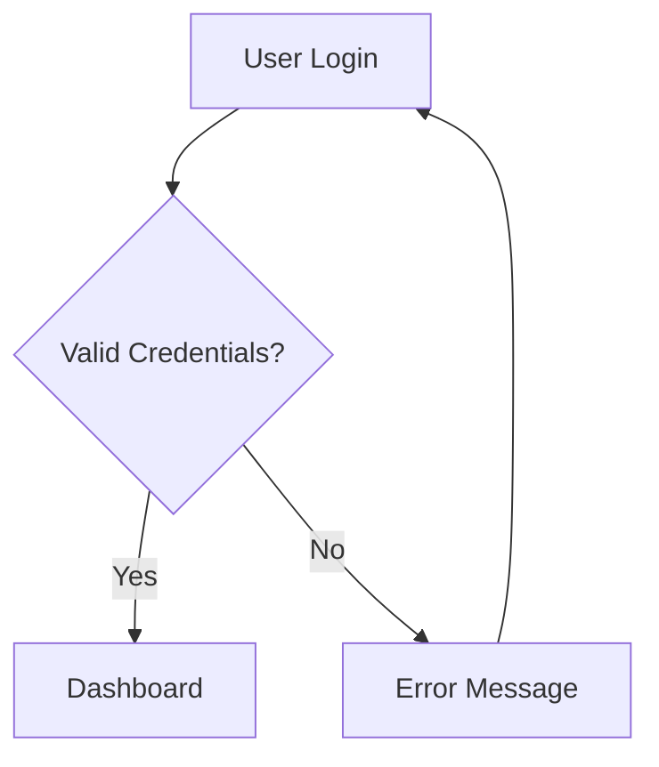

# 📁 Folder: Designs

Tempat menyimpan artefak desain dan spesifikasi:

- **Wireframe & Mockup** — Dalam format Markdown, ASCII art, atau link ke tool desain
- **Flow Diagram** — User flow, data flow, sequence diagram (Mermaid syntax)
- **UI/UX Specification** — Deskripsi komponen, behavior, state
- **API Contract** — Draft OpenAPI spec sebelum implementasi

## Konvensi Penamaan

```
<YYYY-MM-DD>_<fitur>_<tipe>.md

Contoh:
2026-10-07_user-onboarding_flow-diagram.md
2026-10-15_dashboard_wireframe.md
2026-11-01_checkout-api_openapi-draft.md
```

## Tips Diagram dengan Mermaid



---
*Folder dibuat: 2026-10-07*
